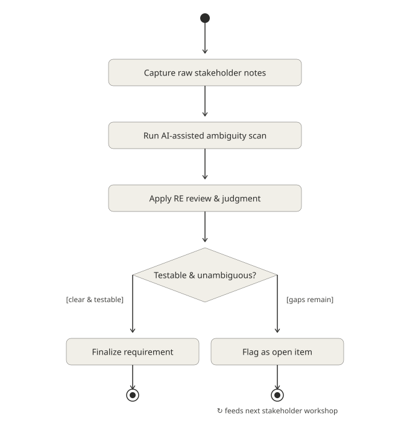

# Case Study 01: Ambiguous & Underspecified Requirements

## Why this problem

Across repeated industry surveys of practicing requirements engineers and business analysts (e.g. the NaPiRE initiative, which has run for over a decade across multiple countries), **ambiguous and underspecified requirements are consistently ranked among the most frequently experienced RE problems** — ahead of tooling gaps, process maturity, or even stakeholder availability. They're also one of the most expensive to leave unresolved: an ambiguous requirement doesn't fail at requirements time, it fails weeks or months later, during integration, verification, or acceptance testing, when it's far more expensive to fix.

## The scenario

A mid-sized facilities technology company is building a **building access control system** for corporate office sites. The system will control physical entry via badge/biometric readers, integrate with an HR system for employee role data, and log access events for security audits.

Below is the kind of input a Requirements Engineer actually receives at the start of such a project: notes from a kickoff call with the Head of Facilities and the IT Security Lead, lightly cleaned up but deliberately left in its natural, underspecified form.

This is the raw material for the case study — see `01-raw-stakeholder-input.md`.

Here is a UML activity diagram of the AI-assisted RE process

## What "solving" this looks like

The goal isn't to produce a perfect requirements document from a single pass. It's to demonstrate a repeatable process:

1. Use AI to do a fast first-pass scan for ambiguity, vague terms, and missing information — the kind of thing that's tedious and easy to skim past manually, especially under deadline pressure.
2. Apply RE judgment to the AI's findings: which flagged issues are real, which are noise, what context the AI is missing, and what a *sensible, testable* resolution actually looks like for this system.
3. Produce a final requirement set that would pass a real requirements review — atomic, testable, unambiguous, each with a defined verification method.
