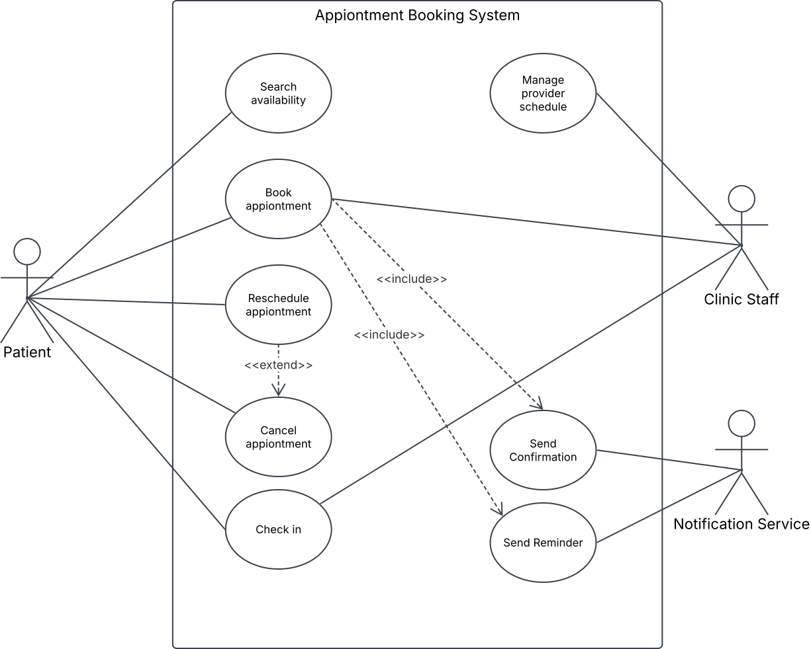

# UML Use Case Diagram — Appointment Booking System

## What this models

The functional scope of the system from the outside: who interacts with it (actors) and what they can accomplish (use cases), inside the system boundary.

**Actors**
- **Patient** : primary actor, initiates `Search Availability`, `Book Appointment`, `Reschedule Appointment`, `Cancel Appointment`, `Check In`
- **Clinic Staff** : secondary human actor, connected to `Manage Provider Schedule`, `Book Appointment` (booking on a patient's behalf, walk-in or by phone), and `Check In` (front-desk check-in)
- **Notification Service** : secondary system actor, connected to `Send Confirmation` and `Send Reminder`. It doesn't initiate anything on its own; it's the actor that *executes* those two use cases once they're triggered by `Book Appointment`.

**Relationships**
- `Book Appointment` **includes** `Send Confirmation` and `Send Reminder` : these always happen as part of a successful booking, so they're mandatory sub-behavior, not optional. That's why `<<include>>` is the correct relationship and not `<<extend>>`. Because the Notification Service is the actor that actually carries out both included use cases, it gets its own direct association to both an included use case still needs its performing actor drawn, even though the *trigger* comes from the base use case.
- `Reschedule Appointment` **extends** `Cancel Appointment` : rescheduling is an optional variant invoked *from* the cancel flow under a condition ("patient wants a new slot instead of a full cancellation"), which is exactly what `<<extend>>` is for. This sits alongside a direct Patient → Cancel Appointment association, not instead of one: a patient needs to be able to cancel outright, independent of ever going through reschedule.

## Why this diagram

A use case diagram is the right first artifact when scoping a system for stakeholders who don't want to read structured requirements yet. In real RE work I'd normally do this scoping conversation with text (actor/goal tables, elicitation workshops) building it as a diagram here forces the same discipline: every actor needs at least one reachable use case, every include/extend relationship needs a real justification, or it doesn't belong on the page.

## Where I'd push back if this were a real project

A generic "Manage Provider Schedule" use case is too much work: in a real elicitation session I'd split it into at least "Set Availability" and "Block Time Off," because they have different triggers, different actors involved, and different edge cases (a blocked slot with an existing booking is a conflict that needs its own resolution rule). I kept it merged here to keep the diagram more clear at portfolio scale, but flagging that trade-off explicitly is itself part of the RE judgment that this repo is meant to demonstrate.
