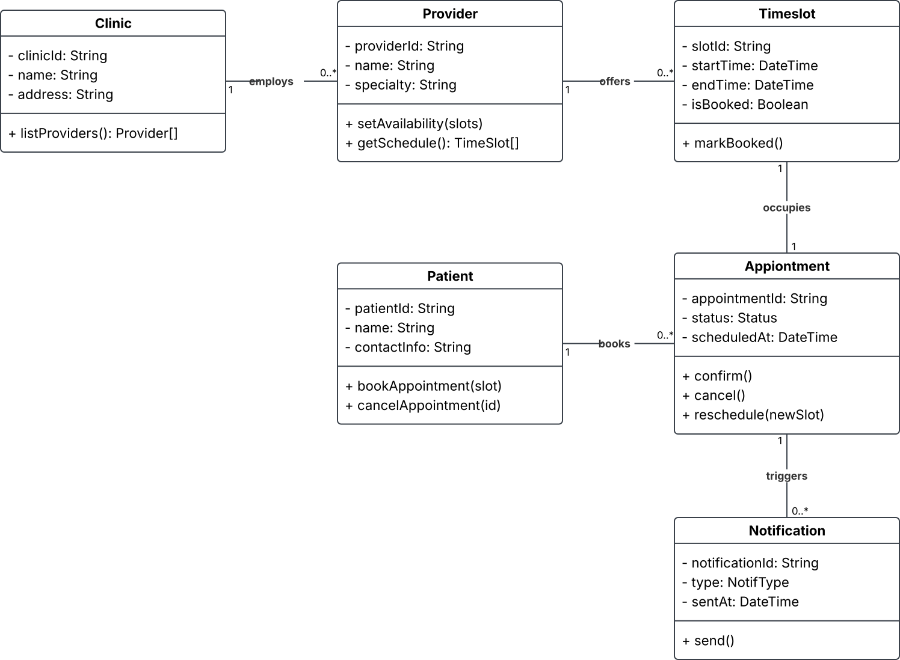

# UML Class Diagram — Appointment Booking System (Domain Model)

## What this models

The static domain model behind the use cases: the entities the system needs to track, their attributes and operations, and how they relate to each other — this is the diagram that answers "what data structures does this system actually need, and what are the rules connecting them?"

**Entities:** `Clinic`, `Provider`, `TimeSlot`, `Patient`, `Appointment`, `Notification`

**Multiplicities and why they matter**
- `Clinic 1 — 0..* Provider` (employs): a clinic can have zero providers on day one (newly onboarded), so `0..*` rather than `1..*`.
- `Provider 1 — 0..* TimeSlot` (offers): same logic — a provider can exist in the system before any availability is published.
- `Patient 1 — 0..* Appointment` (books): a patient can have no appointments yet, or several (past + future).
- `TimeSlot 1 — 1 Appointment` (occupies): this is the constraint that actually matters for correctness — one appointment occupies exactly one time slot, and (implicitly, enforced elsewhere, e.g. in the `TimeSlot.isBooked` flag) one time slot can be occupied by at most one appointment. A class diagram alone can't fully express that inverse constraint; it would need an OCL rule or a stated business rule in the requirements text.
- `Appointment 1 — 0..* Notification` (triggers): zero if the reminder job hasn't fired yet, more than one once both confirmation and reminder have gone out.

## Why this diagram, and not something else

The class diagram is where ambiguous language gets forced into a decision. "The system sends a reminder" (natural-language requirement) doesn't say whether a `Notification` is a first-class entity with its own history, or just a side-effect with no stored record. Modeling it as a class with `− sentAt: DateTime` is a design decision, not a neutral fact — and that's worth being explicit about, because it changes what's testable ("was a reminder ever sent for this appointment?" becomes answerable) and what a QA engineer would need to verify.

## Where I'd push back if this were a real project

`Appointment.status` is typed as a bare `Status` with no enumeration shown. In real requirements work this is exactly the kind of underspecified attribute that causes downstream defects — I'd insist on an explicit state list (`Requested`, `Confirmed`, `CheckedIn`, `Completed`, `Cancelled`, `NoShow`) and, more importantly, a state diagram showing which transitions are valid, before this class diagram could be considered "requirements-ready" rather than just a sketch.
