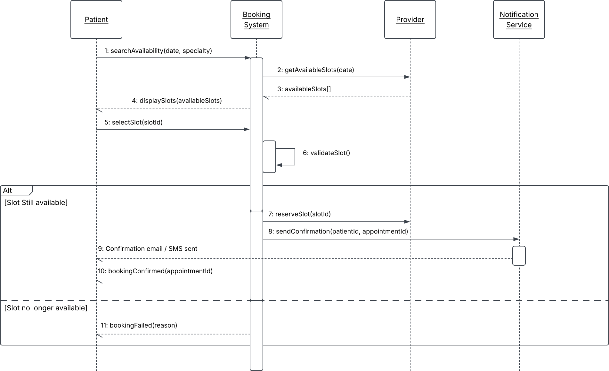

# UML Sequence Diagram — Book Appointment Flow

## What this models

The runtime interaction for a single use case (`Book Appointment`) between four participants — `Patient`, `Booking System`, `Provider`, `Notification Service` — showing the actual order of messages, which calls are synchronous, which are returns, and where the flow branches.

**Notation used**
- Solid arrow + filled arrowhead = synchronous call
- Dashed arrow = return message
- Rectangle on a lifeline = activation (the object is actively doing work)
- Self-message (`validateSlot()`) = the system checking its own state before committing to a branch
- `alt` combined fragment = the two mutually exclusive outcomes of the booking attempt: slot still available vs. slot taken in the meantime (a real race condition, not a hypothetical one — two patients can view the same open slot before either confirms)

## Why this diagram, and not something else

Use case and class diagrams describe *what* the system can do and *what it's made of* — neither one forces you to confront timing and concurrency. The `alt` fragment here exists specifically because the use case diagram's `<<include>>` relationship for `Send Confirmation` hides an important detail: confirmation only happens on one branch. Building the sequence diagram is what surfaced that the "slot no longer available" path needed its own message (`bookingFailed`) that doesn't appear anywhere in the higher-level diagrams. That's a common experience in real RE work: the sequence diagram is often where an inconsistency you didn't know existed becomes visible for the first time — and this small synthetic example was no exception.

## Where I'd push back if this were a real project

Step 6 (`validateSlot()`) is drawn as a simple self-message, but in a real system this is exactly where a race condition lives — two patients selecting the same slot within milliseconds of each other. I'd flag this to the dev team as needing an explicit locking or optimistic-concurrency requirement (e.g. "the system shall reject a booking attempt against a slot that was reserved by another transaction within the same request window") rather than leaving it as an implied detail inside a single self-call.
