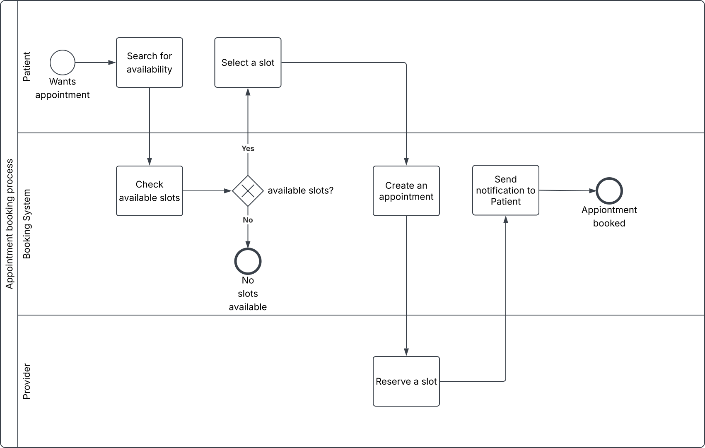

# BPMN Process Diagram — Appointment Booking Process

## What this models

The same booking scenario as the UML diagrams, but from a process perspective: one pool (`Appointment Booking Process`), three swimlanes (`Patient`, `Booking System`, `Provider`), showing who does what, in what order, and where the process splits.

**Notation used**
- Circle = start event
- Rectangle = task
- Diamond (with X) = exclusive gateway (exactly one outgoing path is taken)
- Bold circle = end event. there are two: "No slots available" and "Appointment booked," because a process can legitimately end more than one way

## Why BPMN, and not another UML activity diagram

I deliberately used BPMN here instead of a UML activity diagram, even though both notations can express control flow, because BPMN's swimlanes make responsibility more explicit in a way a UML activity diagrams don't do as cleanly also the responsibility (who owns which step, and where a handoff happens) is usually the actual point of documenting a business process for stakeholders outside engineering. When a task crosses a lane boundary in this diagram (for example `Select a slot` in the Patient lane handing off to `Create an appointment` in the Booking System lane), that's a real handoff a process owner would care about as a scheduling delay, an SLA, a point where the process can stall if nobody follows up.

## A deliberate scope decision worth calling out

The use case diagram includes both `Send Confirmation` and `Send Reminder` as behaviors triggered by `Book Appointment`. This BPMN diagram only shows `Send confirmation to Patient`. That is intentional as a reminder fires on a timer before the appointment date, not synchronously at the moment of booking, so it belongs to a separate scheduled process rather than this linear, request driven booking flow. Modeling it here would conflate two different trigger types (event-driven vs time-driven) inside one diagram a reminder process would be its own BPMN diagram with a timer start event, not an extra task bolted in this one.

## Where I'd push back if this were a real project

The "no slots available" branch just ends: in a real process, a dead end like that is a requirements gap, not an acceptable outcome. I'd push back and ask: does the patient get offered a waitlist? A different provider? A different date range automatically re-searched? Ending a lane at a bare end event is a legitimate way to say "out of scope for this version," but it should be a stated decision in the requirements, not something that quietly falls out of the diagram because nobody asked.
